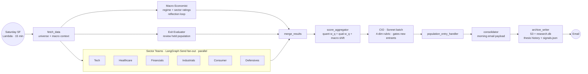

# alpha-engine-research

> Part of [**Nous Ergon**](https://nousergon.ai) — Autonomous Multi-Agent Trading System. Repo and S3 names use the underlying project name `alpha-engine`.

[](https://nousergon.ai)
[](https://www.python.org/)
[](https://langchain-ai.github.io/langgraph/)
[](https://www.anthropic.com/)
[](LICENSE)
[](https://github.com/cipher813/alpha-engine-docs#phase-trajectory)

Multi-agent investment-research pipeline. Six sector teams, a CIO, and a macro economist scan the S&P 500+400 weekly, maintain rolling investment theses, and emit `signals.json` for the rest of the system. Built on LangGraph with Anthropic Claude (Haiku per-team, Sonnet for synthesis).

> System overview, Step Function orchestration, and module relationships live in [`alpha-engine-docs`](https://github.com/cipher813/alpha-engine-docs).

## What this does

- Runs **six sector teams in parallel** via LangGraph `Send()` fan-out: Technology, Healthcare, Financials, Industrials, Consumer, Defensives. Each team owns its GICS sector slice of the S&P 500+400 (~110-215 tickers per team).
- Per-team flow: **quant analyst** (ReAct, Haiku, tool-calling — volume / technicals / fundamentals / options flow) → **qualitative analyst** (ReAct, Haiku — news / analyst reports / insider / SEC filings via RAG) → **peer review** → 2-3 ranked recommendations + thesis update.
- **Macro economist** runs in parallel with the sector teams (independent reflection loop), producing market regime + per-sector ratings that scale recommendations downstream.
- **CIO** (single Sonnet batch call) evaluates every recommendation against a 4-dimension rubric (team conviction · macro alignment · portfolio fit · catalyst specificity), gates new entrants per a configurable cap, and writes ADVANCE / REJECT / NO_ADVANCE_DEADLOCK with full rationale.
- **LLM-as-judge layer** scores agent outputs at key stages against rubric prompts (sector peer review currently; expanding). Every decision is captured to S3 with prompt metadata + cost telemetry for replay and audit.
- Maintains rolling thesis history per ticker — material-trigger-driven updates (news spike, price move > 2 ATR, analyst revision, earnings proximity, insider cluster, regime change) rather than full rewrites every week.

## Phase 2 measurement contribution

Research is the system's narrow waist between data and decisions. Phase 2 contribution: **every agent decision is captured as a structured artifact** — prompt id + version + hash, full prompt context, input snapshot, agent output, and cost — so any decision is replayable, auditable, and attributable to a specific prompt revision. The LLM-as-judge layer scores agent quality at key stages with rubric-based grading. Together these produce the substrate that lets Phase 3 measure whether prompt or model changes actually improve the agent layer, not just whether the system happens to make money in a given week.

## Architecture



Each sector team is itself a sub-graph: `quant_analyst → qual_analyst → peer_review → recommendations + thesis_update`. The quant and qual analysts are ReAct agents with tools; peer review is a single-shot finalization step.

**Decision-artifact capture** runs at every LLM call site via `LoadedPrompt` (frontmatter-versioned prompts, sha256 body hash, hard-fail on missing) plus `track_llm_cost` ContextVar accumulator. Every artifact is persisted to S3 under `decision_artifacts/{date}/{agent_id}/{run_id}.json`. Cost telemetry is captured per call (one JSONL row per Anthropic invocation) and aggregated to a daily parquet for the backtester evaluator email.

## Key files

| File | What it does |
|---|---|
| [`graph/research_graph.py`](graph/research_graph.py) | Top-level LangGraph orchestrator — Send fan-out, fan-in, state schema |
| [`agents/sector_teams/sector_team.py`](agents/sector_teams/sector_team.py) | Per-team sub-graph: quant → qual → peer review |
| [`agents/sector_teams/qual_tools.py`](agents/sector_teams/qual_tools.py) | Qual analyst's tool surface (incl. `query_filings` → RAG via `alpha_engine_lib.rag`) |
| [`agents/investment_committee/ic_cio.py`](agents/investment_committee/ic_cio.py) | CIO batch evaluation, 4-dim rubric, ADVANCE / REJECT / DEADLOCK |
| [`agents/macro_agent.py`](agents/macro_agent.py) | Macro economist with reflection loop |
| [`evals/judge.py`](evals/judge.py) | LLM-as-judge rubric scoring + persistence |
| [`graph/llm_cost_tracker.py`](graph/llm_cost_tracker.py) | Per-call cost telemetry + run-budget hard ceiling |
| [`scoring/composite.py`](scoring/composite.py) | Composite score formula (proprietary weights live in `alpha-engine-config`) |
| [`archive/manager.py`](archive/manager.py) | S3 + SQLite persistence; thesis history; IC audit trail |

## How it runs

| Stage | Where | When | Trigger |
|---|---|---|---|
| Pipeline | Lambda (Docker on ECR) | Sat 00:00 UTC, ~15 min | Saturday Step Function (after DataPhase1, RAGIngestion) |
| Local dry run | Laptop venv | On demand | `.venv/bin/python local/run.py --dry-run` |
| Local stub run | Laptop venv | On demand | `.venv/bin/python local/run.py --stub-llm` (no API spend) |

Deploy: `./infrastructure/deploy.sh main`.

## Configuration + disclosure boundary

This repo is **public**, but anything proprietary lives in the private [`alpha-engine-config`](https://github.com/cipher813/alpha-engine-config) repo or is gitignored locally. Specifically:

- **Agent prompts** — gitignored (`.py` files containing `_PROMPT_TEMPLATE` / `_build_system_prompt`); loaded at runtime via `LoadedPrompt` from the config repo
- **Scoring weights + sub-score formulas** — in `alpha-engine-config`
- **Universe + sector configuration** — `config/universe.yaml`, gitignored
- **Population selection logic** — `data/population_selector.py`, gitignored
- **Technical scoring** — `scoring/technical.py`, gitignored

The orchestration layer (`graph/research_graph.py`), tool wrappers (`agents/sector_teams/{quant,qual}_tools.py`), CIO scaffolding, and persistence (`archive/manager.py`) are all public. Architecture and approach are public; specific weights, prompts, and thresholds are private.

Environment variables: `ANTHROPIC_API_KEY`, `FMP_API_KEY`, `FRED_API_KEY`, `RAG_DATABASE_URL`, `VOYAGE_API_KEY`, AWS credentials. See `.env.example` for the full list.

## Outputs

### S3
| Path | Content |
|---|---|
| `signals/{date}/signals.json` | Universe + buy_candidates + market_regime + sector_ratings + population — read by Predictor + Executor |
| `archive/universe/{TICKER}/` | Per-ticker rolling thesis snapshots (never overwritten) |
| `archive/candidates/{TICKER}/` | Per-ticker buy-candidate theses |
| `archive/macro/` | Macro environment reports |
| `consolidated/{date}/morning.md` | Morning email payload |
| `decision_artifacts/{date}/{agent_id}/` | Replay-grade decision capture |
| `decision_artifacts/_cost_raw/{date}/{run_id}/` | Per-call LLM cost JSONLs |
| `research.db` | SQLite — signal history, theses, IC audit trail |

## Quick start

```bash
git clone https://github.com/cipher813/alpha-engine-research.git
cd alpha-engine-research
python -m venv .venv && source .venv/bin/activate
pip install -r requirements.txt

cp .env.example .env
# Edit .env — set ANTHROPIC_API_KEY, FMP_API_KEY, FRED_API_KEY, AWS creds, RAG_DATABASE_URL, VOYAGE_API_KEY

# Stub run (no API spend) — verifies graph wiring + persistence
.venv/bin/python local/run.py --stub-llm

# Real dry run (small population, no S3 writes)
.venv/bin/python local/run.py --dry-run --tickers AAPL,MSFT
```

## Testing

```bash
pytest tests/ -v
```

Tests cover state schemas, scoring math, LangGraph trajectory invariants (e.g., `sector_team_node` runs exactly 6 times per Send), reducers, decision-artifact capture, RAG retrieval shape, and prompt-versioning regression locks.

## Sister repos

| Module | Repo |
|---|---|
| Executor | [`alpha-engine`](https://github.com/cipher813/alpha-engine) |
| Data | [`alpha-engine-data`](https://github.com/cipher813/alpha-engine-data) |
| Predictor | [`alpha-engine-predictor`](https://github.com/cipher813/alpha-engine-predictor) |
| Backtester | [`alpha-engine-backtester`](https://github.com/cipher813/alpha-engine-backtester) |
| Dashboard | [`alpha-engine-dashboard`](https://github.com/cipher813/alpha-engine-dashboard) |
| Library | [`alpha-engine-lib`](https://github.com/cipher813/alpha-engine-lib) |
| Docs | [`alpha-engine-docs`](https://github.com/cipher813/alpha-engine-docs) |

## License

MIT — see [LICENSE](LICENSE).
